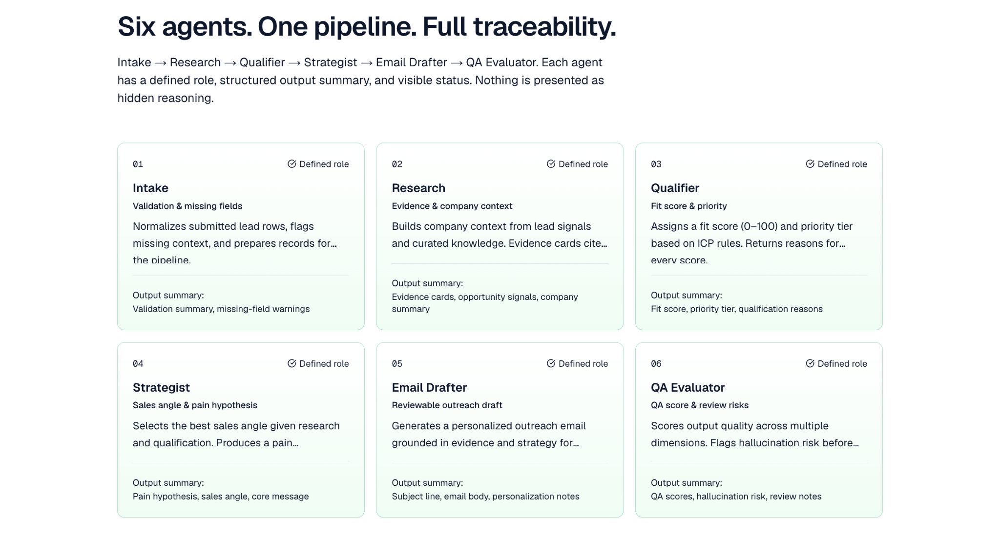
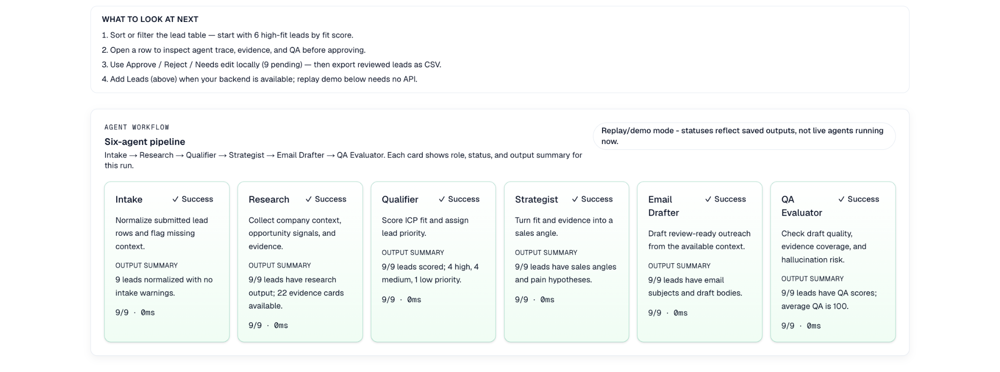
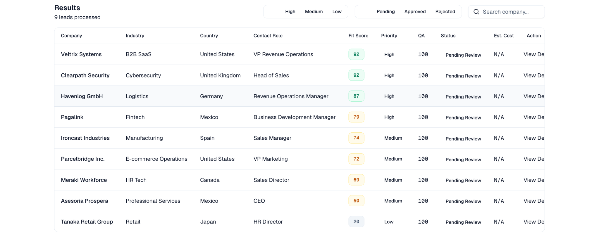
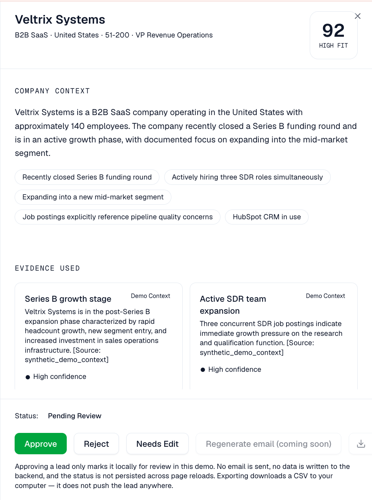
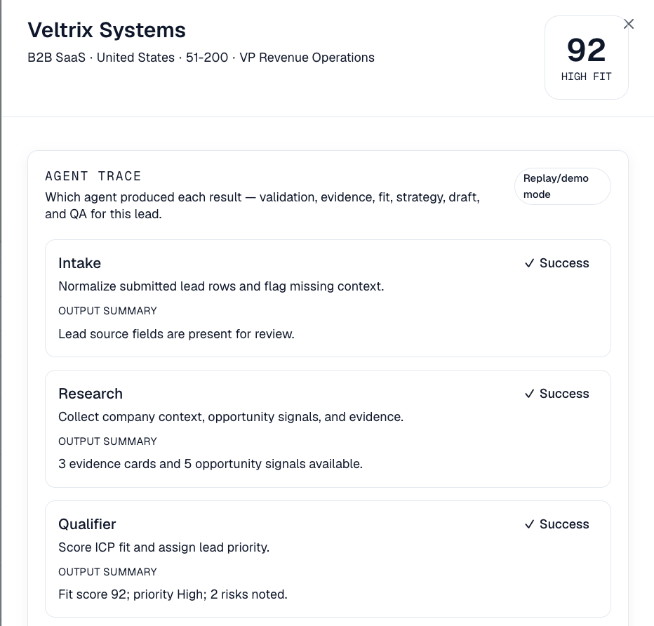
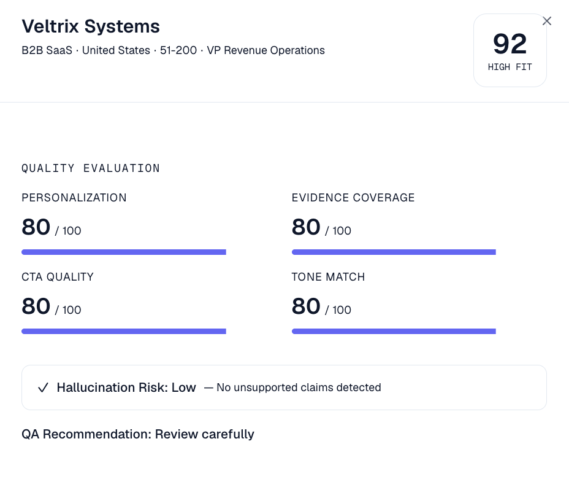
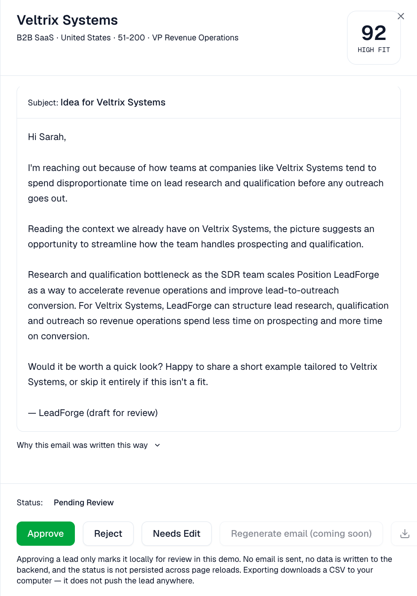
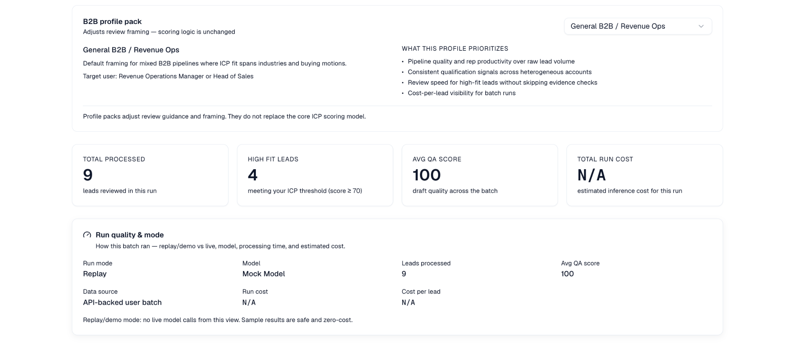
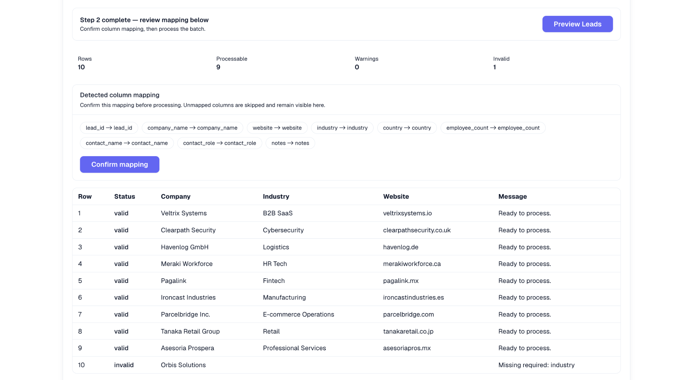

# LeadForge — Agentic B2B Sales Intelligence

**Project 1 · Portfolio Release**

Traceable B2B sales intelligence with controlled AI workflow and human decisions.

LeadForge is a **review-first sales intelligence workflow** for B2B lead qualification, strategy, outreach drafting, QA evaluation, and human review. It shows how agentic systems can support revenue operations **without unsupervised outbound automation** — draft-only outreach copy, local human review, and no email sending or CRM writes.

| | |
|---|---|
| **Category** | Agentic AI / Revenue Ops / B2B Sales Intelligence |
| **Status** | Completed / Portfolio Release |
| **Demo** | [v0-project-1-delta-lovat.vercel.app/demo](https://v0-project-1-delta-lovat.vercel.app/demo) |
| **Video** | [YouTube walkthrough playlist](https://youtube.com/playlist?list=PLWHDR1oCK8kv8BKlhIce515TlO6OkWOVP&si=FNxQ2KqgrcAjoSHL) |
| **GitHub** | [dannzapper-cmd/project-1](https://github.com/dannzapper-cmd/project-1) |

The public demo runs in **replay/cost-safe** mode by default. Add Leads → Preview → Process requires a reachable FastAPI backend (`NEXT_PUBLIC_API_URL`). Live batch Groq execution is intentionally unavailable in the UI.

---

## Visual evidence

Local PNG evidence assets derived from real LeadForge demo captures. Demo leads use **synthetic/curated context** — not live company intelligence.

### Landing / Positioning



*Landing page evidence showing LeadForge's controlled sales intelligence positioning and agent-pipeline narrative.*

### Demo Workflow



*Demo workflow section showing agent stages and review guidance for the sales intelligence process.*

### Lead Table



*Processed leads with fit, priority, and QA-oriented outputs.*

### Lead Detail



*Evidence-backed lead detail with agent outputs.*

### Agent Trace



*Partial trace view showing visible agent execution steps and structured outputs.*

### QA Evaluation



*Quality gate, recommendation, and risk signals before human review.*

### Human Review



*Local human review of draft outreach before export.*

### Run quality & telemetry



*Summary-safe run metadata: mode, model, QA aggregates, and cost visibility.*

### Intake preview



*Smart intake foundation with column mapping and row-level validation.*

---

## What it does

LeadForge runs a **deterministic sales intelligence pipeline** over curated demo leads and user-supplied intake rows. **Five core intelligence agents** — Research, Qualifier, Strategist, Email Drafter, and QA Evaluator — run after an intake/normalization step:

**Intake → Research → Qualifier → Strategist → Email Drafter → QA Evaluator**

Each step produces structured outputs and trace metadata. A Next.js dashboard surfaces leads, agent results, traces, QA scores, **local human review**, and **local CSV export** of reviewed leads. A FastAPI backend serves demo data, runs the pipeline, exposes **read-only telemetry**, and optionally supports a **backend-only, opt-in Groq single-lead path** with **deterministic-vs-live comparison**.

**Core user flow**

```
Landing → Demo dashboard → Add Leads (paste/upload) → Preview (valid/warning/invalid)
  → Process → Results table → Lead detail → Agent trace + QA
  → Human review (browser-local) → Export reviewed leads (CSV)
```

---

## Problem / Solution

**Problem.** Revenue teams lose time to manual account research, inconsistent qualification, generic outreach, and low visibility into *why* an AI suggested a message or priority.

**Solution.** LeadForge turns B2B sales intelligence into a **traceable, review-first workflow**: structured lead intake, deterministic agent collaboration, QA scoring, transparent traces, local human review, and exportable reviewed outputs — **without sending emails or writing to a CRM**.

---

## Architecture & controlled agent pipeline

```
User
  → Next.js Frontend (/demo)
  → FastAPI Backend
  → Intake / normalization
  → Deterministic Pipeline (plain Python)
  → Five core agents (Research → Qualifier → Strategist → Drafter → QA)
  → Trace + QA Evaluation
  → Human Review (browser-local)
  → Local Export (CSV)
```

| Step | Agent | Output (summary) |
|------|--------|------------------|
| 1 | Research | Company summary, signals, pains, evidence cards |
| 2 | Qualifier | Fit score, priority, rationale |
| 3 | Strategist | Angle, hypothesis, core message, personalization |
| 4 | Email Drafter | Subject and body **draft** (not sent) |
| 5 | QA Evaluator | QA score, recommendation, risk signals |

Orchestration is **linear** and **in-process** — not a LangGraph graph. See [`docs/architecture-overview.md`](docs/architecture-overview.md) and [ADR-001](docs/adr/langgraph-decision.md).

**Optional Groq Live Demo Mode (opt-in, unlock-gated):**

```
GET  /api/demo/live/status
POST /api/demo/live/unlock   (server-side code validation)
POST /api/demo/live/run      (max 3 leads, rate-limited)
  → real Groq model calls when enabled
  → explicit Replay / Deterministic / Groq Live / Fallback badges
  → no live web research, no email sending, no CRM writes
```

Replay/demo mode remains the default. The dashboard Groq Live panel is optional
and disabled until the demo owner shares an unlock code with the reviewer.

**Supporting internal live paths (still supported):**

```
POST /api/demo/pipeline/live-groq/{lead_id}
  → single lead
  → token/cost limited
  → deterministic-vs-live comparison
  → API-only full-pipeline comparison

POST /api/demo/email/regenerate-draft/{lead_id}
  → selected lead context only
  → draft-only live Groq regeneration
  → controlled lead-drawer action when backend status allows
```

---

## Technical highlights

| Area | Implementation |
|------|----------------|
| **Agent pipeline** | Five core agents (Research, Qualifier, Strategist, Email Drafter, QA Evaluator) preceded by intake/normalization |
| **Frontend** | Next.js demo dashboard — lead table, detail drawer, traces, QA, review state |
| **Backend** | FastAPI — health, demo pipeline, intake preview, telemetry endpoints |
| **Smart intake** | Paste, CSV, Excel, and text-based PDF preview/validation (max 10 leads/run) |
| **Public demo** | Replay/cost-safe mode — bundled sample results, no surprise model spend |
| **Live comparison** | Backend-only opt-in Groq single-lead pipeline; no public batch automation |
| **Human review** | Browser-only approve/reject/flag; local CSV export |
| **Safety layer** | Rate limits, optional demo access code, request IDs, security headers, safe status endpoints |
| **Telemetry** | Summary-safe, in-memory telemetry with capped recent-run listing |
| **Orchestration** | Plain Python (`pipeline_service.py`) — LangGraph **deferred**, not used today |

**Tech stack:** Next.js (App Router), React, TypeScript, Tailwind CSS, Radix UI · FastAPI, Pydantic v2, SQLAlchemy 2.x, SQLite · optional Groq via backend-only `GroqModelService`.

---

## Safety & boundaries

LeadForge **prepares review-ready sales intelligence**; it does **not** run a fully autonomous outbound program.

| Boundary | Behavior |
|----------|----------|
| Email sending | **Never** — drafts only |
| CRM writes | **Never** — export stays local |
| Human review | Browser-local state; not persisted to backend |
| Public demo | Replay/cost-safe by default; Groq Live is opt-in and unlock-gated |
| Live Groq | `LIVE_MODE_ENABLED` + `GROQ_API_KEY` + server-side unlock; session/IP/budget limits |
| Live research | **Not** part of Groq Live Demo Mode — no scraping or citations |
| Fallbacks | Explicitly labeled — never presented as Groq Live |
| Demo data | Synthetic/curated intelligence — not real-time market research |
| Telemetry | Summary metadata only — no full prompt store |

**Do not claim:** autonomous SDR replacement, guaranteed reply rates, LangGraph runtime today, live web research by default, production multi-tenant SaaS, or real company intelligence when data is synthetic/demo context.

---

## Demo links

| Resource | URL |
|----------|-----|
| **Live demo** | [https://v0-project-1-delta-lovat.vercel.app/demo](https://v0-project-1-delta-lovat.vercel.app/demo) |
| **Landing** | [https://v0-project-1-delta-lovat.vercel.app](https://v0-project-1-delta-lovat.vercel.app) |
| **Video playlist** | [YouTube — production-like walkthrough](https://youtube.com/playlist?list=PLWHDR1oCK8kv8BKlhIce515TlO6OkWOVP&si=FNxQ2KqgrcAjoSHL) |
| **Repository** | [https://github.com/dannzapper-cmd/project-1](https://github.com/dannzapper-cmd/project-1) |
| **Local dashboard** | [http://localhost:3000/demo](http://localhost:3000/demo) |

The recorded demo shows the stable replay-mode public demo. Controlled live-mode affordances may differ slightly in the latest deployed version. See [`docs/demo-video.md`](docs/demo-video.md).

### Demo access code

If the deployed demo is configured with `DEMO_ACCESS_CODE`, enter the code
shared with the demo link. The code is not shipped in frontend environment
variables and is stored only in the current browser tab's `sessionStorage`.

### Public demo vs controlled technical demo

| | **Public demo** | **Controlled technical / interview demo** |
|---|-----------------|-------------------------------------------|
| Default mode | Replay / cost-safe | Backend Groq opt-in via configuration |
| Audience | Recruiters, portfolio visitors | Technical review, interviews |
| API spend | No surprise model cost on the public path | Provider usage only when explicitly enabled |
| Live batch Groq | **Not** exposed in the UI | **Not** available — single-lead only |
| Regenerate | Replay draft by default | Single-lead draft regeneration when backend status allows |
| Secrets | No Groq keys in the frontend | Backend-only (`GROQ_API_KEY`, env flags) |
| Gates | Rate limits, max leads per run | Demo-access gated, rate-limited |
| Outreach | Draft-only, human-in-the-loop | Draft-only — **no email sending**, **no CRM writes** |

---

## Portfolio signal — why this project matters

LeadForge is an **applied AI product engineering** case study, not a pitch deck:

- **Controlled workflow design** — agents collaborate in a fixed order with QA before human review, instead of open-ended automation.
- **Traceability as a product feature** — fit rationale, evidence cards, agent traces, and QA risk flags make AI outputs inspectable.
- **Production-minded demo** — rate limits, optional access codes, replay-safe public mode, summary-safe telemetry, and explicit failure semantics on the opt-in live path.
- **Honest scope** — roadmap items, LangGraph deferral, and synthetic demo data are documented separately from shipped behavior.
- **Deterministic baseline as test oracle** — the mock/deterministic path supports regression testing; live Groq comparison is additive, not a silent fallback.

Relevant deep dives: [`docs/case-study.md`](docs/case-study.md) · [`docs/portfolio-narrative.md`](docs/portfolio-narrative.md) · [`docs/portfolio/LEADFORGE_PORTFOLIO_PACK.md`](docs/portfolio/LEADFORGE_PORTFOLIO_PACK.md)

---

## Implemented today

| Capability | Notes |
|------------|--------|
| Deterministic five-agent pipeline | Five core agents after intake/normalization; plain-Python orchestration — see `backend/app/services/pipeline_service.py` |
| Batch deterministic pipeline | Up to 10 demo leads per batch run |
| Next.js dashboard | `/demo` — lead table, lead detail drawer |
| Smart lead intake foundation | CSV, Excel, PDF, and pasted table preview/validation in `/demo` |
| Production-safety layer | In-memory rate limiting, optional demo access code, request IDs, security headers |
| Agent traces | Per-step input/output summaries in API and UI |
| QA evaluations | Scores and recommendations visible in UI |
| Local browser-only human review | Not persisted to backend |
| Local reviewed-lead CSV export | Browser download only |
| FastAPI backend | Health, demo pipeline, agents, intake preview, telemetry |
| Safe in-memory telemetry | Summary metadata only; capped recent-run listing |
| Backend-only opt-in live Groq (single lead) | `POST /api/demo/pipeline/live-groq/{lead_id}`; off by default |
| Controlled live draft regeneration | `POST /api/demo/email/regenerate-draft/{lead_id}`; single selected lead, demo-access gated, draft-only |
| LangGraph deferred | Per [ADR-001](docs/adr/langgraph-decision.md) — **not** a graph runtime today |

---

## What it does not do

- Image/OCR intake (CSV, Excel, text-based PDF, and paste **are** supported)
- LangGraph runtime or checkpointed agent graphs
- CRM integration or backend sync of review state
- Email sending or deliverability tooling
- Durable telemetry database or long-term eval history store
- Frontend batch “Run live Groq” button or automatic live pipeline execution
- Full authentication, payments, or multi-tenancy
- Guaranteed reply rates or “AI replaces SDRs” automation

---

## Local setup

### Prerequisites

- Node.js 18+ and [pnpm](https://pnpm.io/)
- Python 3.11+ (for backend)
- *(Optional)* Groq API key for live comparison experiments only

### Frontend

```bash
pnpm install
cp .env.example .env.local   # optional; defaults to mock data
pnpm dev
```

- Landing: [http://localhost:3000](http://localhost:3000)
- Dashboard: [http://localhost:3000/demo](http://localhost:3000/demo)

### Backend (for API mode and telemetry)

```bash
cd backend
python -m venv .venv
source .venv/bin/activate          # Windows: .venv\Scripts\activate
pip install -r requirements.txt
cp .env.example .env
uvicorn app.main:app --reload --host 0.0.0.0 --port 8000
```

Connect the dashboard in `.env.local`:

```env
NEXT_PUBLIC_DATA_SOURCE=api
NEXT_PUBLIC_API_URL=http://localhost:8000
```

### Enable Groq Live Demo Mode locally (optional)

The app and tests start **without** `GROQ_API_KEY`. To try real Groq live runs locally:

```bash
# backend/.env
LIVE_MODE_ENABLED=true
GROQ_API_KEY=your_key_here
GROQ_DEFAULT_MODEL=llama-3.1-8b-instant
```

Then on the dashboard (`/demo`):

1. Process leads in **Replay** mode (default).
2. Open the **Groq Live Demo Mode** panel.
3. Enter the unlock code shared by the demo owner for that session.
4. Select a lead (click a row) and click **Run Groq live**.

Limits (defaults): max **3** leads per run, **3** session runs/day, **$1.00** daily budget, **30s** timeout. Fallback outputs are labeled explicitly — never as Groq Live. LeadForge **never sends email automatically** and live mode performs **no live web research**.

Optional real Groq smoke tests only:

```bash
RUN_GROQ_LIVE_TESTS=1 GROQ_API_KEY=... pytest -q backend/tests/test_groq_live_smoke.py
```

More detail: [`backend/README.md`](backend/README.md) · [`docs/deployment.md`](docs/deployment.md)

---

## Testing / verification

```bash
# Frontend
pnpm install
pnpm typecheck
pnpm test:unit
pnpm build
pnpm lint

# Backend
cd backend
pip install -r requirements.txt
pytest -q
```

GitHub Actions runs frontend typecheck, unit tests, and build plus backend `pytest -q` on pushes and PRs (see [`.github/workflows/ci.yml`](.github/workflows/ci.yml)).

---

## Repository structure

```
.
├── app/                    # Next.js App Router (landing, /demo)
├── components/             # UI (dashboard, landing, shared)
├── lib/                    # API client, mock data, types
├── data/demo/              # Curated demo leads and research fixtures
├── backend/                # FastAPI app, agents, pipeline services
├── docs/
│   ├── assets/screenshots/ # Screenshot evidence (see latest/)
│   ├── portfolio/          # Portfolio pack for cross-project reuse
│   └── …
└── README.md
```

Screenshot assets: [`docs/assets/screenshots/README.md`](docs/assets/screenshots/README.md) · capture guide: [`docs/screenshots-checklist.md`](docs/screenshots-checklist.md)

---

## Documentation index

| Document | Description |
|----------|-------------|
| [Case study](docs/case-study.md) | Problem, architecture, impact, trade-offs |
| [Business case](docs/business-case.md) | Illustrative ROI, industry benchmarks, safe claims |
| [Portfolio narrative](docs/portfolio-narrative.md) | CV bullets, interview talking points |
| [Portfolio pack](docs/portfolio/LEADFORGE_PORTFOLIO_PACK.md) | Structured facts for README / Project 4 reuse |
| [Architecture overview](docs/architecture-overview.md) | System design, diagrams, production gaps |
| [Demo script](docs/demo-script.md) | 2–4 min video script + shorter walkthroughs |
| [Demo video](docs/demo-video.md) | Recorded playlist link and versioning notes |
| [Deployment guide](docs/deployment.md) | Render backend deployment and Vercel wiring |
| [Operations runbook](docs/operations.md) | Env vars, smoke checks, rollback, rate-limit notes |
| [ADR-001: LangGraph](docs/adr/langgraph-decision.md) | Why graph runtime is deferred |
| [Advanced capabilities roadmap](docs/roadmap/advanced-capabilities.md) | Implemented vs future capability table |
| [Backend README](backend/README.md) | API details, live Groq endpoint, tests |

---

## License

See repository license file if present. Otherwise treat as private/demo codebase until a license is added.
